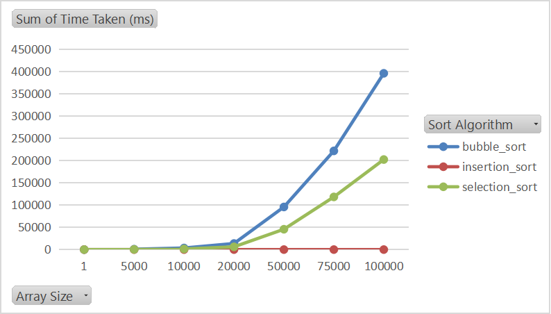
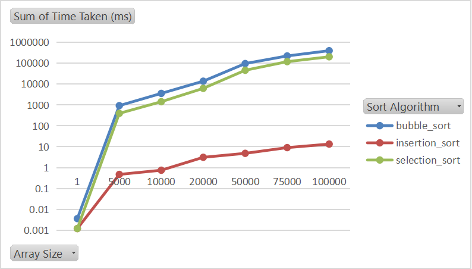

## DSII Assignment 1

### TA Instructions

Here is the [document](https://docs.google.com/document/d/1swRiyFBWtCAOdHuiIguP1ch9cXSR88NP/edit) that the TA sent including the instructions regarding this assignment.

### Team Members

- Andrew Sameh Adel Mikhail, ID **9489**

- Ahmed Abd Al Moneim, ID **9284**

- Galal Mohamed, ID **9453**

### Results



#### Using Logarithmic y axis 



### Current Project Structure

```text
│   
└─── .gitignore
│   
└─── README.md
│   
└─── bubble_sort.py
│   
└─── insertion_sort.py
│   
└─── selection_sort.py
│   
└─── timer.py
│   
└─── main.py
```